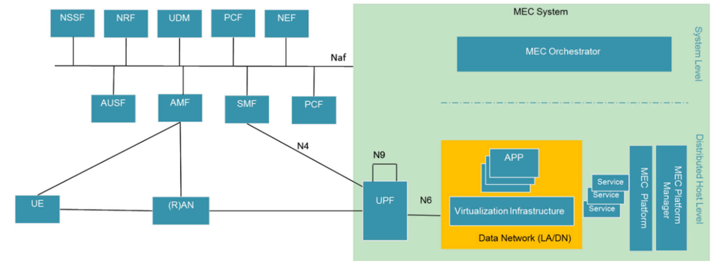
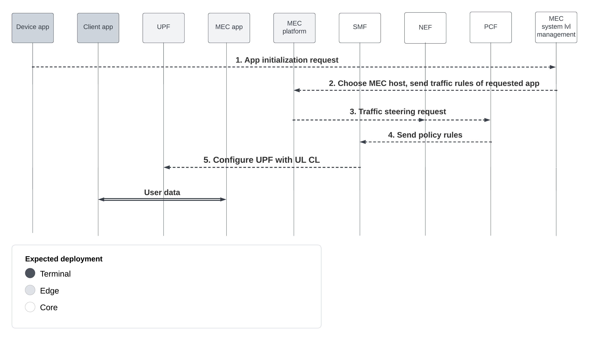
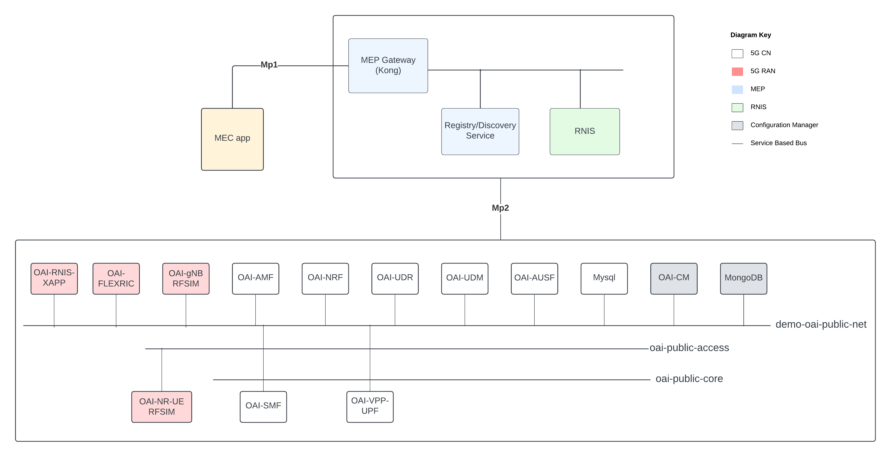
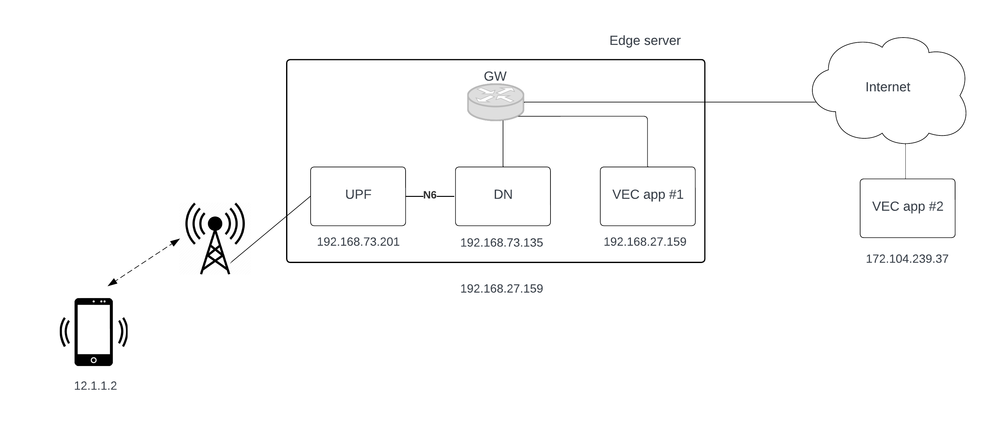

</img>

# Documentation of VEC testbed
### semestral project, NSI

## Motivation
* Vehicular Edge computing (VEC), i.e., utilization of computational resources at mobile networks' edges to facilitate task offloading from Autonomous Vehicles (AVs).
* state-of-the-art AVs require robust HW infrastructure, which drives up vehicles' power consumption and decreases effective travel distance.
* this project designs and implements VEC testbed to evaluate algorithms for allocation of computational and communication resources

## Design
* based on 3GPP standardized 5G mobile networks and ETSI standardized Multi-Access Edge Computing (MEC).
* figures below provide:
  1. basic overview of possible integration of 5G and MEC.
  2. call flow for establishment of a PDU session towards MEC edge server (MEC host)

</img>

</img>

## Implementation
* VEC testbed leverages OpenAirInterface (OAI) MEC Platform (OAI MEP)
* OAI MEP consists of the following parts:
    1. OAI 5G core network
    2. OAI 5G RAN with the necessary functionality to expose RAN information
    3. OAI configuration manager collecting and exposing core network information (SMF and AMF)
    4. OAI Radio Network Information Service (RNIS)
    5. Discovery and Registry Service
    6. MEP Gateway (reverse proxy)
    7. sample app showcasing a MEC app susbscribing to RNIS [(example app)](./mep/examples/example-mec-app.py)

</img>

* documenation of a sample app registration using the Registry and Discovery Service [registration](./sample_app/README.md).

## Evaluation
* the testbed has been evaluated against cloud deployment to showcase its feasibility for VEC algorithm testing
* evaluated deployments:
    1. Cloud deployed approximately 400 km from emulated User Equipment (UE) device.
    2. Edge deployment (MEC host collocated with 5G user plane) in an emulated docker OAI environment.
* the experiment was run in OAI RFsim simulation mode, i.e. without the radio interface [(read more about RFsim)](https://gitlab.eurecom.fr/oai/openairinterface5g/-/blob/develop/radio/rfsimulator/README.md)
* utilizing ping to measure Round Trip Time (RTT) differnce between deployments.

</img>

 Results:

<table class="tg">
<thead>
  <tr>
    <th class="tg-0lax">Edge [ms]</th>
    <th class="tg-0lax">Cloud [ms]</th>
  </tr>
</thead>
<tbody>
  <tr>
    <td class="tg-0lax">5.58</td>
    <td class="tg-0lax">13.53</td>
  </tr>
</tbody>
</table>

## Read more
To read more about this project, you can check the bachelor's thesis [here](https://github.com/vojtechh12/bthesis/blob/master/bthesis.pdf).