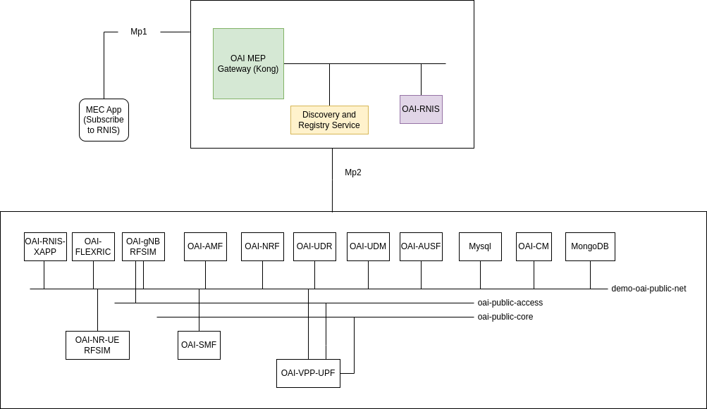

<table style="border-collapse: collapse; border: none;">
  <tr style="border-collapse: collapse; border: none;">
    <td style="border-collapse: collapse; border: none;">
      <a href="http://www.openairinterface.org/">
         
         </img>
      </a>
    </td>
    <td style="border-collapse: collapse; border: none; vertical-align: center;">
      <b><font size = "5">OpenAirInterface Multi-access Edge Computing Platform Blueprint</font></b>
    </td>
  </tr>
</table>

Multi-access Edge Computing platforms (MEP) is a part of the ETSI MEC architecture. Our implementation of MEC platform allows different MEC applications to discover MEP hosted services and register their own service which can be discovered by other MEC applications. 

[OAI-MEP](https://gitlab.eurecom.fr/oai/orchestration/oai-mec/oai-mep) follows ETSI GS MEC 003 V3.1.1. MEC appications communicate with MEP via `mp1` interface and applications hosted at MEP communicates with Radio Access Network (RAN) and Core Network (CN) components via `mp2` interface. MEC [Radio Network Information Service (RNIS)](https://gitlab.eurecom.fr/oai/orchestration/oai-mec/oai-rnis) is based on ETSI GS MEC 012. It collects the radio network information via `mp2` interface and exposes to interested applications via `mp1`.

This blueprint showcases the abilities of OAI-MEP and OAI-RNIS in ETSI MEC Framework.




**TABLE OF CONTENTS**
1.  [Overview](#1-overview)
2.  [Deploy Core and Ran Components](#2-deploy-core-and-ran-components)
3.  [Deploy OAI-MEP](#3-deploy-oai-mep)
4.  [Deploy OAI-RNIS](#4-deploy-oai-rnis)
5.  [Consume RAN KPIs from OAI-RNIS](#5-consume-ran-kpis-from-oai-rnis)
6.  [Clean Up](#6-clean-up)
7.  [Leave a Feeback or Ask Questions](#7-leave-a-feedback-or-ask-questions)

## 1. Overview

This blueprint showcases an implementation of [ETSI Multi-access Edge Computing Platform (MEP)](https://www.etsi.org/deliver/etsi_gs/MEC/001_099/003/03.01.01_60/gs_MEC003v030101p.pdf) and[ Radio Network Information Service (RNIS)](https://www.etsi.org/deliver/etsi_gs/MEC/001_099/012/02.01.01_60/gs_mec012v020101p.pdf) for 5G. The goal of this blueprint is to demonstrate a MEC application consuming RAN and Core KPIs exposed via RNIS. We are using oai 5g core basic deployment with vpp-upf. At the moment only VPP-UPF provides user monitoring information. 

Though in this blueprint we are using oai-gnb and oai-nr-ue in RFsimulated mode it is possible to use oai-gnb with a COTS UE. In our labs we test with both RFSim and COTSUE. Testing with RFSIM is easy and avoids the need of having hardware to understand how RNIS works. 


### 1.1 Pre-requisite

1. Docker version > 22
2. CPU with avx2 (needed for gNB and nr-ue)
3. Tested on Ubuntu 22.04, 20.04 and 18.04
4. 8CPU and 16GB of RAM

**Note**: In docker version 23 and above compose command is integrated in docker cli. So you can use `docker compose` instead of `docker-compose`

## 2. Deploy the Core and RAN Components

All the docker images which will be used in this blueprint are present in our official docker hub repository.

### 2.1 Deploy OAI 5G Core Network

We are using release v1.5.0 of oai 5g core network basic deployment with vpp-upf.

```shell
docker-compose -f docker-compose/docker-compose-core-network.yaml up -d
```
Check if the core network is healthy 

```shell
docker-compose -f docker-compose/docker-compose-core-network.yaml ps -a
```

### 2.2 Deploy OAI-Configuration Manager (OAI-CM)

The role of [oai-configuration manager](https://gitlab.eurecom.fr/oai/orchestration/oai-cm) is to subscribe the events from the core network functions and expose it to other components. Later it will have the ability to configure the core network functions using a GUI. 

```shell
docker-compose -f docker-compose/docker-compose-cm.yaml up -d
```

Check if the components are healty

```shell
docker-compose -f docker-compose/docker-compose-cm.yaml ps -a
```
### 2.3 Deploy RAN Components

In this blueprint we are using OAI-gNB in RFSimulated mode it is possible to use it with COTS UE. We are using FlexRIC version 1.0.0 and gNB branch mep-compatible. At the time of writing this blueprint flexric version 1.0.0 required gNB tag `2022.41` our branch is based on this tag. Once FlexRIC E2 agent is merged in develop branch we will start using develop branch of oai-gnb.

```shell
docker-compose -f docker-compose/docker-compose-ran.yaml up -d oai-gnb oai-flexric rabbitmq
```

Check if the ran components are healthy 

```shell
docker-compose -f docker-compose/docker-compose-ran.yaml ps -a
```
Now deploy the RNIS xAPP

```shell
docker-compose -f docker-compose/docker-compose-ran.yaml up -d oai-rnis-xapp
```

To verify that everything is done correctly so far, login to RabbitMq management console http://192.168.70.166:15672/#/queues to see that message queue `rnis_xapp` has been created. RabbitMq username and password is `user|passsword` If the queue has been created then please move forward. 


## 3. Deploy OAI-MEP

```shell
docker-compose -f docker-compose/docker-compose-mep.yaml up -d
```

Check if MEP components are healthy

```shell
docker-compose -f docker-compose/docker-compose-mep.yaml ps -a
```

Add the below line in your `/etc/hosts` else MEP will not be able to route the `mp1` traffic to the right service hosted at the mep.

```shell
192.168.70.2 oai-mep.org  
```

To access the OpenAPI defination or swagger GUI of MEP --> http://oai-mep.org/service_registry/v1/ui

## 4. Deploy OAI-RNIS

Now lets deploy OAI-RNIS and expose it via `mp1` interface so that a MEC application can consume Radio Network KPIs. When RNIS starts it automatically sends a service registration request to MEP. 

```shell
docker-compose -f docker-compose/docker-compose-rnis.yaml up -d
```

Check if RNIS is healthy

```shell
docker-compose -f docker-compose/docker-compose-rnis.yaml ps -a 
```

To access the OpenAPI defination or swagger GUI of RNIS --> http://oai-mep.org/rnis/v2/ui

You can check the services exposed by MEP via

```shell
curl http://oai-mep.org/service_registry/v1/discover
```

## 5. Consume RAN KPIs from OAI-RNIS

There are two ways to fetch KPIs from RNIS either via a get request or via subscribing and then RNIS will send the KPIs automatically. 

To fetch the KPIs via get request

```shell
curl -X 'GET' 'http://oai-mep.org/rnis/v2/queries/layer2_meas' -H 'accept: application/json'
```

To subscribe the RNIS KPIs we have created an example MEC application which consumes the KPIs via `mp1` interface. The MEC application is written using Python Flask framework. 

To setup the environment for MEC application, create a virtual python environment using pyvenv or virtualenv if you want or you can skip this setup and install the prerequisite

```shell
#create a virtual python environment (Optional)
virtualenv -p python3 venv
## Install prerequisite (Mandatory)
pip install flask requests
```

Start the application

```shell
python examples/example-mec-app.py
```

Start the UE 

```shell
docker-compose -f docker-compose/docker-compose-ran.yaml up -d oai-nr-ue
```

Now you can see in the dashboard of example app that there RAN KPIs or you can fetch manually via 

```shell
curl -X 'GET' 'http://oai-mep.org/rnis/v2/queries/layer2_meas' -H 'accept: application/json'
```

At the moment in RF simulator some of the KPIs are static. If you know how to change the channel module in oai-gNB RFSIM then you can play with that. 

## 6. Clean Up

To stop the containers you can run:

```shell
docker-compose -f docker-compose/docker-compose-core-network.yaml down -t2
docker-compose -f docker-compose/docker-compose-ran.yaml down -t2
docker-compose -f docker-compose/docker-compose-cm.yaml down -t2
docker-compose -f docker-compose/docker-compose-mep.yaml down -t2
docker-compose -f docker-compose/docker-compose-rnis.yaml down -t2
```

Remove the below entry from `/etc/hosts`

```shell
192.168.70.2 oai-mep.org  
```

## 7. Leave a Feedback or Ask Questions

If you have questions or want to leave a feedback feel free to send us an email at `netsoft@eurecom.fr`